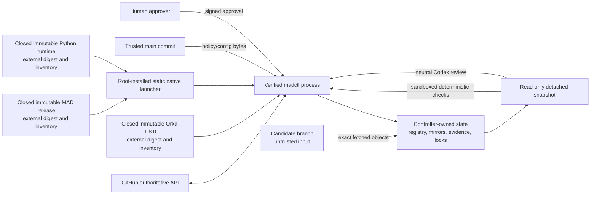
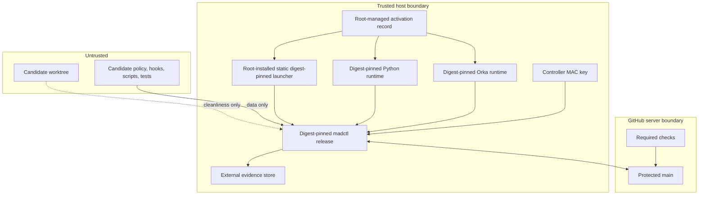

# MAD Final Gates v2

Status: Genesis candidate. This repository contains source for a future installed
controller. It is not an activated authority, and the project hook is not trusted.

## Security invariant and threat model

The branch under review never supplies the executable, schemas, effective policy,
repository registration, signing key, state directory, Git mirror, or GitHub
identity used to decide whether that branch may create a PR or merge. `madctl` is
materialized from a human-approved release outside every candidate worktree. A
candidate checkout is only a developer-facing cleanliness check and untrusted
input to a detached review.

MAD v2 is designed to stop accidental agent bypass, a worker replacing its own
gate, stale or replayed evidence, wrong repository/branch/SHA operations, direct
PR or merge actions inside the managed workflow, policy drift, and reuse of an
approval. It does not protect against a malicious machine owner, root or host
compromise, compromise of the GitHub account or registered human signing key, or
arbitrary external GitHub clients where GitHub server-side rules do not block
them.

## Architecture and trust boundaries





Local evidence proves that one installed controller evaluated exact inputs. Only
GitHub rules can prevent a different client from pushing or merging.

## Genesis

Genesis is a one-time, manual trust-establishment ceremony:

1. Use an isolated branch and worktree. Keep runtime state outside it.
2. Run JSON/YAML/schema/syntax tests, the complete v2 suite, Orka config checks,
   Orka self-check, and Orka's official conformance suite.
3. Run an independent GPT-5.6 Sol High security review of the exact source SHA
   and exact raw diff. The implementer cannot perform that approval review.
4. Obtain an explicit externally signed human approval bound to repository ID,
   source SHA, target SHA, raw diff hash, installed policy digest, proposed
   control-plane digest, risk class `genesis`, nonce, issue time, and expiry.
5. A human creates and merges the first PR through a controlled GitHub client.
   No nonexistent MAD gate is claimed or required for this PR.
6. From the merged trusted main commit, reproducibly build the static native
   launcher and closed MAD release, install them outside Git, stage complete
   Python and Orka 1.8.0 runtimes into immutable external locations, and record
   every tree and inventory digest in root-owned activation metadata.
7. Provision the external registry/state directories, approval-key registry and
   real controller key, register the repository, and configure GitHub protections.
8. Validate the installed release, pinned tools, ChatGPT login, trusted Orka
   runtime, bubblewrap network isolation, and a non-mutating dry run.

Genesis ends only when the approved commit is on protected `main`, its exact
release digest is activated in root-managed metadata, the repository registry is
bound to that release, mandatory GitHub controls are enabled, and the installed
self-test passes. Before that point all PR creation and merge remain manual.

This source change does not perform that activation. The native launcher,
Python/MAD/Orka trees, tools, registry/state and keys still require a later
root-owned installation ceremony. Bubblewrap's current-host `NETLINK_ROUTE`
failure remains activation-blocking. GitHub branch protection/server-side merge
controls and the operational Orka ledger/green-marker bridge also remain later
work; none is claimed complete by the Genesis source.

The Genesis challenge is the only state in which target main may lack both
`.mad/policy.yaml` and `.orchestration/config.yaml`. Absence is encoded as
`present:false, sha256:null, byte_length:null`; it is never the hash of empty
bytes. Partial absence, missing candidate files, or any post-Genesis absence is
rejected.

## Installed control plane

The source package is under `control-plane/src/madctl`, but Python is not the
production trust anchor. A separately installed, statically linked native
`/usr/local/bin/madctl` is the first trust boundary. It has no dynamic loader or
interpreter startup ahead of its checks. It reads only the compiled-in
`/etc/mad/active-release.json`, verifies its own activated path/digest plus the
root-owned activation record and both the MAD and Python closed inventories,
then parses every inventoried ELF file before `execve`. The supported contract is
64-bit little-endian Linux ELF for the launcher's compiled architecture. The
activated interpreter's `PT_INTERP` must resolve to an inventoried file under
the runtime, every `DT_NEEDED` name must resolve exactly to an inventoried
`lib/<soname>`, and dynamic audit/filter behavior is rejected. RPATH/RUNPATH is
accepted only when every component is absolute after the supported `$ORIGIN`
expansion and resolves inside the closed runtime; empty, relative, external and
other variable-expansion behavior is rejected. A host `/etc/ld.so.preload` is
also rejected because its mappings cannot belong to the runtime inventory. Only
after that pre-execution closure succeeds does it fork the
exact activated interpreter with `-P -s -S -B` and a minimal
explicit environment. Caller `LD_PRELOAD`, `LD_AUDIT`, `LD_LIBRARY_PATH`,
`DYLD_*`, `PYTHONPATH`, `PYTHONHOME`, user-site, startup, inspect and warning
settings are not inherited. `PYTHONHOME` and the loader path supplied to Python
are constructed from the already verified runtime root, never caller input, so
the interpreter's initial standard-library search is closed before the Python
launcher imports anything.

The second-stage Python launcher lives inside the verified MAD release. It
requires its parent to be the digest-pinned native launcher, repeats activation,
release and runtime validation, replaces `sys.path` with only the MAD release and
declared runtime import roots, and checks module origins and native process
mappings against those inventories. Direct `python -m madctl`, direct Python
launcher execution, editable installs, system/user site packages, cwd shadowing
and fake packages are non-authoritative.

`control-plane/tools/stage_python_runtime.py` accepts only a preassembled runtime
containing the interpreter, standard library, complete site-packages closure,
native extensions and runtime shared objects together with a separately supplied,
canonical trusted-input lock and wheelhouse. The lock fixes the interpreter and
all non-package runtime file hashes plus the exact filename, version and SHA-256
of every approved wheel. The stager never derives that lock from its input tree.
It checks exact required
`cryptography==41.0.7`, `jsonschema==4.10.3`, and `PyYAML==6.0.1` distribution
metadata plus the exact `attrs==23.2.0`, `pyrsistent==0.20.0`, `cffi==1.16.0`
and `pycparser==2.21` transitive
closure. Each wheel's complete RECORD must exactly cover its files; non-RECORD
entries require valid SHA-256 and size fields, while RECORD's own entry requires
the format-defined empty hash and size. Installed package bytes must exactly
match the locked wheel members, with unique ownership and no unowned importable
or native-extension files. Wheel provenance and the trusted-input-lock digest
are embedded in the generated runtime metadata and closed inventory.
Distribution metadata bytes and every runtime file are hashed. Genuine
ELF inputs are inspected without executing them: interpreters, recursively
resolved needed libraries and search paths must stay inside the staged root;
audit/filter loader directives are forbidden. It produces a deterministic
exact-file/mode inventory and tree digest. Missing, altered, extra, symlinked or
writable runtime content fails closed.

Before importing `madctl`, the launch chain verifies canonical external paths,
the expected MAD version, and the complete `release-files.json` inventory. Every
runtime file and directory is required, unlisted files and directories are
rejected, symlinks and path escape are rejected, modes and ownership are checked,
and tree digests derive from exact bytes and modes. Loaded modules are repeatedly
checked against their respective inventories.

`control-plane/tools/build_launcher.py` reproducibly builds the static native
launcher; `file` must report it statically linked and `ldd` must report that it
is not a dynamic executable. `control-plane/tools/build_release.py` creates the deterministic closed directory
and byte-reproducible ZIP; `build_wheel.py` creates a deterministic transport wheel
containing all runtime data. The ZIP, rather than an unpacked wheel or editable
installation, is the activatable layout. Schemas, sandbox profile, Genesis
policy/config, lock and release metadata, launcher source, and every MAD module
are in the inventory. The external activation contract separately fixes the
native launcher identity, MAD release root/tree/inventory, Python runtime
root/executable/tree/inventory, Orka root/version/tree/inventory, every tool's
canonical path/digest/UID/GID and allowed root, repository registry, controller
state, controller key, Codex home, and human approval-key registry. Git, `gh`,
Codex, bubblewrap, Python and other authority executables are revalidated
immediately before invocation. Their allowed roots and descendant parents must
have the configured trusted ownership and must not be group/world writable. A
candidate-owned executable is never accepted merely because the candidate owns
it. Candidate files may propose future values but cannot install or activate
them.

Production CLI construction has no test-path or state-root flag. Unit tests inject
temporary stores and adapters directly in Python; the installed CLI cannot select
them. `GH_REPO`, `ORKA_PLUGIN_ROOT`, Git repository override variables, and Orka
merge-guard test seams are rejected. Subprocesses get a controller-built PATH and
environment rather than the caller environment.

Control-plane updates are always `control-plane/high-risk`, must pass the old
installed controller, independent Sol High review, and external human approval,
then are installed only from the newly trusted main commit by a human-controlled
release process.

## Repository and source authority

The controller asks GitHub for repository identity and source/target refs, fetches
the exact registered HTTPS repository into a controller-owned bare mirror, and
compares fetched object IDs to GitHub twice. Git hooks, fsmonitor, external diff,
textconv, global/system Git config, prompts, `ext::`, and file transports are
disabled in production. Diff bytes use `git diff --binary --full-index
--no-ext-diff --no-textconv`; name status uses a correctly parsed NUL stream.

Semantic review uses a detached exact-SHA snapshot created with `ls-tree` and
`cat-file`, never a candidate checkout. Symlinks and submodules are rendered as
inert regular marker files. Candidate hooks, binaries, rules, filters, and gate
scripts are not executed. Developer `prepare pre-pr` additionally requires the
candidate checkout HEAD to equal the remote SHA and rejects staged, unstaged, and
untracked state.

## Evidence lifecycle

All evidence schemas are installed with the controller, Draft 2020-12, strict
`additionalProperties:false`, exact required fields, and bounded values. JSON
artifacts have one accepted serialization: sorted compact UTF-8 JSON plus one
final newline. Noncanonical bytes are rejected. Raw Git diff, changed-path stream,
policy/config, Git blobs, QA stdout/stderr, schema files, attestations, and
approvals are hashed without trimming or newline normalization.

1. `challenge`: fresh repository/refs, raw diff digest, path digest,
   source/base/merge-base, explicit file presence, classification, installed
   controller and Orka digests, effective policy and QA plan, run ID, random
   nonce, preparation time/expiry, and recomputed self-hash.
2. `qa-evidence`: exact challenge/source/base/plan binding, sandbox profile,
   command-vector digest, result, timeout, exit code, and exact output digests.
3. `codex-attestation`: exact challenge/source/base/diff binding, CLI version,
   `gpt-5.6-sol`, High effort, exact ChatGPT authentication statement, verdict,
   and structured findings.
4. `human-approval`: external Ed25519 signature over canonical fields, bound to
   repository ID, source/base, raw diff, effective policy, controller release,
   risk, scope, nonce, approver, issued time, and expiry. No private human key is
   generated or stored here.
5. `machine-approval`: controller-MACed synthesis of PASS evidence. Issuance is
   locked and unique per run/operation. State is `approved -> consuming ->
   consumed`, with `indeterminate` fail-closed recovery.
6. `consumption-record`: controller-MACed pre/post action digests, PR, timestamps,
   and outcome. Approvals cannot be replayed.

Challenge and approval timestamps enforce trusted TTLs and bounded future skew.
High-risk and Genesis challenges cannot issue without valid human approval.
Create-PR approvals require pre-PR challenges; merge approvals require fresh
pre-merge challenges.

## QA and classification

Classification is mechanical: `genesis`, `control-plane/high-risk`, `code`, or
`documentation-only`; no-change is refused. A compiled installed minimum covers
`AGENTS.md`, `.codex`, `.github`, `.mad`, `.orchestration`, the control plane,
policies, schemas, scripts, tests, CI/workflow, security, signing, installer,
deployment, packaging and release paths. It also uses case-normalized basename
and glob families for the supported Python, container, JavaScript, Rust, Go,
Ruby, Java/Gradle, .NET, CMake, Composer, Deno, Nix, CocoaPods, Elixir, Dart,
Bazel, dependency automation and Ansible build/dependency files. Candidate policy can add
protection but cannot remove or weaken this installed minimum; unknown paths with
build/release/security-like names are classified conservatively.

The compiled minimum treats every `*.nix` file as high risk, every `ansible`
directory segment as high risk, and the Ansible `roles/*/{defaults,files,handlers,
meta,tasks,templates,vars}` plus `group_vars` and `host_vars` conventions as high
risk at any nesting depth. These classifications always set
`required_human_approval=true` in controller-issued challenges.

Protected directory names are matched in every path segment. The compiled
minimum also includes GitLab, Azure, Bitbucket, Travis, Jenkins, Buildkite,
CircleCI, Gradle wrappers, Terraform, Helm, Kustomize, deployment manifests,
shell/PowerShell installers, NuGet/.NET build files, release metadata/manifests,
cosign/signing, provenance and SBOM material.

The plan comes from trusted target policy (or the installed Genesis policy), not
candidate changes. Code and high-risk classes require a real deterministic
command and cannot pass with zero checks. An installed builtin checks mandatory
source shape, removal of legacy authorities, fixed hook target, policy/config,
and Python syntax; candidate tests are additional input, not the sole gate logic.
Checks run through a digest-pinned bubblewrap binary with no network, no home or
credentials, a read-only detached source, and ephemeral `/tmp`. Empty commands,
missing tools, timeout, nonzero exit, malformed results, or sandbox startup
failure produce FAIL.

## Neutral Codex verifier

The controller pins the exact Codex executable and home, rejects detectable API
key/access-token environment routes, and requires the entire login status output
to equal `Logged in using ChatGPT`. It invokes `gpt-5.6-sol` with reasoning effort
`high`, strict/ignored user configuration, no fallback, read-only sandbox, a
neutral non-repository working directory, installed output schema, and an
environment containing no GitHub credentials. Candidate `AGENTS.md` is proposed
data, not governing instructions. The controller records CLI version, model,
effort, and authentication method and rejects contradictory PASS results.

Normal implementation work should use GPT-5.6 Terra Medium. Security
architecture, final review, pre-PR, and pre-merge critical review use GPT-5.6 Sol
High.

## Orka 1.8.0

Installed-plugin discovery is a Genesis staging input only. It executes the
pinned Codex binary with the registered Codex home and requires exactly one
enabled `orka@personal` at version `1.8.0`; `ORKA_PLUGIN_ROOT` is rejected. The
user-writable plugin cache is never a production runtime.

During human-controlled staging, the entire Orka source tree is copied without
symlinks into a separate external tree. `orka-files.json` inventories every file,
including executable scripts and transitive Python/shell support rather than a
hand-picked script list. The root-owned activation record supplies the expected
canonical root, exact version, full tree digest, and inventory digest. Production
requires every listed file and derived directory, rejects missing or extra files,
unexpected importable/executable files, writable files/directories, ownership or
mode mismatch, symlinks and path escape, and re-verifies the tree immediately
before invoking Orka. The required set explicitly includes `context_pipeline.py`,
`review_permit.py`, `operator_authority.py`, and `runtime_state.py`; future
dependencies cannot be silently omitted because the complete staged tree is
closed and externally digest-pinned.

Pre-merge requires a current controller-owned Orka ledger proving both code and
security review, the correct generation head, no missing gates, plus a fresh
controller-owned all-green marker bound to plugin version and exact head/base.

## PR creation

`madctl pr create` accepts only an approval ID and bounded title/body/draft
presentation fields. Repository, base, head, and SHAs come from the approval and
challenge; no raw `gh` arguments exist. Immediately before action, refs are
rechecked. After creation, the controller re-reads GitHub and checks repository,
open state, draft policy, PR number, head repository/branch/SHA, and base
repository/branch/SHA. An uncertain network outcome is reconciled by exact
base/head/head-SHA rather than blindly retried; mismatch becomes indeterminate.

## Merge

`madctl pr merge` accepts only a canonical positive PR number and approval ID.
There is no repository, source branch, source SHA, strategy, raw argument, or
verify-path input. Identity comes from GitHub plus current approval data. The
controller requires current QA/attestation/human evidence, GitHub required
checks, Orka ledger/marker, unchanged refs and PR metadata, then invokes the fixed
squash strategy with expected-head matching. It re-reads authoritative metadata
and requires proof of merged state and a merge commit. Unknown outcomes consume
the approval into `indeterminate` for human reconciliation.

## Defense-in-depth hook

`.codex/hooks.json` calls exactly `/usr/local/bin/madctl hook pre-tool-use`.
Malformed Bash events fail closed and obvious direct `gh`, API merge,
`merge-on-green.sh`, legacy wrapper, nested shell, `sudo`, `exec`, `nohup`,
`timeout`, `env`, `command`, combined-flag, absolute-path, and multi-command
bypasses are covered by tests.

This hook is not an authoritative boundary. A subprocess, another interpreter,
an unhooked shell, a modified Codex client, a direct GitHub client, or a user who
can change local files can bypass it. Its only purpose is to prevent common
mistakes inside a cooperative Codex session. GitHub protection and the installed
controller provide the actual managed-workflow boundaries.

## GitHub controls required before automated merge

Mandatory controls on `main` are: PR required; direct push denied to all normal
actors; force-push and deletion denied; required objective CI/MAD status checks;
stale approvals/checks invalidated by a new head; and GitHub Apps/tokens scoped
minimally. Require up-to-date branches or a merge queue where supported. For a
single-owner repository, do not require an impossible second GitHub approval;
the external signed high-risk approval is distinct from GitHub review.

No real automated merge is allowed until these controls are verified from an
account that cannot bypass them accidentally. Server controls are not configured
by this candidate.

## Source layout and migration

```text
.mad/
  control-plane.lock.json       declarative proposed release/strategy
  policy.yaml                   target-controlled policy source
control-plane/
  src/madctl/                   future installed authority source
  schemas/                      future installed strict schemas
  tests/                        Genesis and conformance candidate tests
  launcher/                     static native anchor + Python second stage
  tools/                        deterministic launcher/release/runtime staging
  sandbox-profile.json          installed QA profile
docs/MAD_FINAL_GATES_V2.md       non-authoritative specification
.codex/hooks.json               optional defense in depth
.orchestration/config.yaml      declarative Orka source, pinned to 1.8.0
```

The v1 repository-authoritative Python gate, verifier shell, PR wrapper, merge
wrapper, old schema, old tests, and v1 document were deleted. No repository
script remains an alternate production path.

## Acceptance phases

- Phase 1: strict schemas, canonical bytes, explicit Genesis absence, policy and
  config validation. Accept when malformed/extra/stale/partial evidence fails.
- Phase 2: external registry/state, release identity, locks/nonces/consumption,
  typed CLI/core. Accept when source execution cannot activate authority and
  replay/races fail closed.
- Phase 3: authoritative refs, neutral mirror/snapshot, dirty checkout rejection,
  pinned Codex and Orka discovery. Accept when all override and mismatch tests pass.
- Phase 4: trusted-plan QA, neutral Sol High attestation, external human approval,
  machine synthesis. Accept when forgery, TTL/skew, zero-check, candidate-policy,
  and isolation tests pass.
- Phase 5: structured GitHub PR/merge adapters, reconciliation, expected head,
  immediate recheck, postcondition verification. Accept with recording stubs and
  no real GitHub mutation.

Before the first commit: run every local validation listed in the implementation
report, inspect that runtime evidence is absent, and obtain an independent Sol
High review. Before the first real PR: complete Genesis human approval, validate
the exact source/target/diff, confirm GitHub server protections, install nothing
from the candidate, and use the documented manual controlled PR. Automated PR
or merge begins only after Genesis ends.

## Remaining limitations and activation blockers

- This Genesis candidate source implements the static launcher, closed MAD and
  Python runtime contracts, deterministic builds, closed Orka staging, and
  external activation contract. None is installed or activated: the root-owned
  launcher/release/runtime, `/etc/mad/active-release.json`, external
  registry/state, approval-key registry, and controller MAC key do not yet exist.
- The current user-installed Orka plugin is source material only. A root-owned,
  full-tree-inventoried, externally digest-pinned Orka runtime has not been staged
  or activated.
- No real Ed25519 human signing key has been issued. Tests use ephemeral fixtures.
- The current host/container denies bubblewrap network-namespace setup. Because
  the sandbox fails closed, production activation is blocked until a trusted host
  proves no-network bubblewrap operation (or a separately reviewed equivalent).
- GitHub protection and required checks are not configured yet.
- Direct GitHub access outside the managed workflow remains possible until those
  server controls are enabled.
- Machine owner/root, GitHub account, Codex account, and human-key compromise are
  outside repository-local protection.
- PR creation and merge adapters are tested only with recording stubs in this
  phase. A later human-controlled staging exercise must validate the exact `gh`
  version/API fields without mutating the real repository.
- The controller-owned Orka review-ledger/all-green-marker bridge is still an
  automated-merge blocker until a trusted external producer and end-to-end
  integration are installed and validated. It does not block source review or
  the manual Genesis PR/merge ceremony.
- Pixel Agents remains an architectural requirement from `AGENTS.md`; this gate
  candidate neither removes nor implements that separate subsystem.
